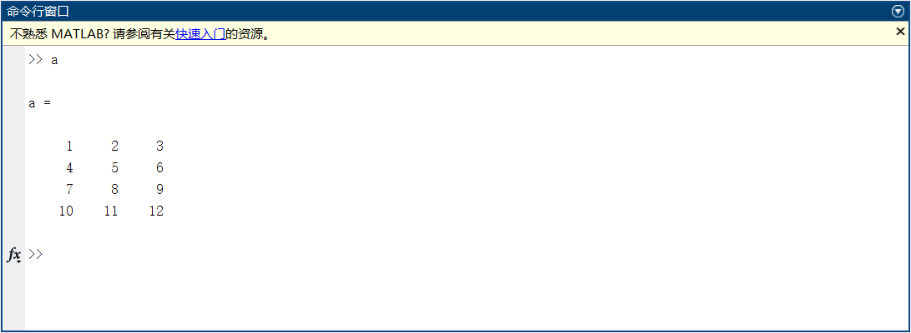

### $$数字图像处理（上机课一）$$

———计科1804 赵艺通 2018040435

### 实验内容：
#### 一、Matblab基本操作

1.熟悉Matlab软件使用环境，更改当前文件夹路径并新建空白脚本文件（扩展名为.m）

    ·更改当前文件夹路径：点击"浏览文件夹"修改路径
    ·新建空白脚本文件：点击"新建脚本"
2.在脚本文件中编写代码，构建一个4×3的矩阵变量，运行该脚本。
参考代码：a = [1, 2, 3; 4, 5, 6; 7, 8, 9; 10, 11, 12];

    ·在新建的脚本文件中，写入a = [1, 2, 3; 4, 5, 6; 7, 8, 9; 10, 11, 12];点击运行
3.在工作区中查看变量a。在命令行窗口中输入a，查看变量a。

    ·在工作区中查看变量a

    ·在命令行窗口中查看变量a

4.使用+、-运算符进行矩阵加减运算
    
    ·计算a+a，a-a

5.区分.\*、\*、./、/四种运算符的区别。

|矩阵运算|矩阵运算符|含义|约束条件|
| :---: | :---: |:---:|:---:|
|矩阵加法|A+B|矩阵相加|A、B行列数相同|
|矩阵减法|A-B|矩阵相减|A、B行列数相同|
|矩阵乘法|A*B|A和B的矩阵相乘|A的列数必须和B的行数相同|
|矩阵.* |A.*B|A和B中的元素按位置依次相乘|A、B行列数相同|
|矩阵除法|A/B|A乘以B的逆矩阵|
|矩阵./|A./B|A和B中的元素按位置依次相除|A、B行列数相同|

6.使用exp(a)、a.^2、cos(a)、log(a)、log10(a)等运算符对矩阵a进行变换。

|运算符|含义|
| :---: | :---: |
|exp(a)|每个数都计算成e的a次方|
|a.^2|每个数都变成2次方|
|cos(a)|每个数都计算cos值|
|log(a)|每个数都计算以e为底的对数|
|log10(a)|每个数都计算以10为底的对数|

7.计算矩阵的转置和逆。

|计算方法|运算符|说明|
|:---:|:---:|:---:|
|转置|a.'|
|共轭转置|a'|矩阵转置后，再把矩阵的每个元素求共轭|
|逆|inv(a)或a^-1|

#### 二、Matlab图像操作

1.使用imread、imshow、imwrite函数读取、显示、保存图片。

    %读取图片
    a=imread('D:\CAST\MATLAB\PROGRAM\二、Matlab图像操作\lena_color_512.tif')
    %显示图片
    imshow(a)
    %保存图片
    imwrite(a,'test.png')
2.将具有RGB三通道的彩色图像提取为3个单通道的灰度图像。

    %提取图像三通道信息
    channel_1=a;
    channel_2=a;
    channel_3=a;
    %将其他两个通道的灰度值变成0
    channel_1(:,:,2)=0;
    channel_1(:,:,3)=0;%只剩R通道
    channel_2(:,:,1)=0;
    channel_2(:,:,3)=0;%只剩G通道
    channel_3(:,:,1)=0;
    channel_3(:,:,2)=0;%只剩B通道
    %显示 subplot(x,y,z)显示b行a列个图像，这是其中第z个
    subplot(2,2,1);
    imshow(channel_1);
    title('R通道');
    imwrite(channel_1,'3个单通道的灰度图像\R通道.png')
    subplot(2,2,2);
    imshow(channel_2);
    title('G通道');
    imwrite(channel_2,'3个单通道的灰度图像\G通道.png')
    subplot(2,2,3);
    imshow(channel_3);
    title('B通道');
    imwrite(channel_3,'3个单通道的灰度图像\B通道.png')
    subplot(2,2,4);
    imshow(a);
    title('原图');
3.根据课件中的公式，利用矩阵的四则运算，对灰度图像进行不同类型的灰度变换，改变图像亮度、对比度。显示变换后的图像，与原始图像进行对比。

    imshow(a/256);%将图像矩阵转化到0-1之间
    imshow(a,[]);%自动调整数据的范围以便于显示
    imshow(a,[])相当于imshow(a,[min(a),max(a)])
    内部计算公式：
    b=(a-min(a(：)))./(max(a(：))-min(a(：)))*255;%a为double型
    imshow(uint8(b));

4.根据课件中的公式，使用maketform函数构造不同类型的变换矩阵（平移、缩放、旋转、错切、透视），之后使用imtransform函数对图像进行几何变换。显示变换后的图像，与原始图像进行对比。

##### [几何变换]线性变换

线性变换
$$
\left[
\begin{matrix}
    x' \\
    y' \\
\end{matrix}
\right]=
\left[
\begin{matrix}
    a & b \\
    c & d \\
\end{matrix}
\right]
\left[
\begin{matrix}
    x \\
    y \\
\end{matrix}
\right]
$$
$x'=ax+by, y'=cx+dy$

###### 基本变换一：翻转（Flip）

水平翻转：
$$
\left[
\begin{matrix}
    x' \\
    y' \\
\end{matrix}
\right]=
\left[
\begin{matrix}
    -1 & 0 \\
    0 & 1 \\
\end{matrix}
\right]
\left[
\begin{matrix}
    x \\
    y \\
\end{matrix}
\right]
$$
垂直翻转：
$$
\left[
\begin{matrix}
    x' \\
    y' \\
\end{matrix}
\right]=
\left[
\begin{matrix}
    1 & 0 \\
    0 & -1 \\
\end{matrix}
\right]
\left[
\begin{matrix}
    x \\
    y \\
\end{matrix}
\right]
$$

###### 基本变换二：旋转（Rotation）

旋转：
$$
\left[
\begin{matrix}
    x' \\
    y' \\
\end{matrix}
\right]=
\left[
\begin{matrix}
    cosθ & -sinθ \\
    cosθ & sinθ \\
\end{matrix}
\right]
\left[
\begin{matrix}
    x \\
    y \\
\end{matrix}
\right]
$$

###### 基本变换三：缩放（Scale）

缩放：
$$
\left[
\begin{matrix}
    x' \\
    y' \\
\end{matrix}
\right]=
\left[
\begin{matrix}
    c_x & 0 \\
    0 & c_y \\
\end{matrix}
\right]
\left[
\begin{matrix}
    x \\
    y \\
\end{matrix}
\right]
$$

###### 基本变换四：错切（Shear）

错切：
$$
\left[
\begin{matrix}
    x' \\
    y' \\
\end{matrix}
\right]=
\left[
\begin{matrix}
    1 & S_h \\
    S_v & 1 \\
\end{matrix}
\right]
\left[
\begin{matrix}
    x \\
    y \\
\end{matrix}
\right]
$$
$水平错切：S_v=0$
$垂直错切：S_h=0$

###### 基本变换五：平移（Translation）

平移：
$$
\left[
\begin{matrix}
    x' \\
    y' \\
    1 \\
\end{matrix}
\right]=
\left[
\begin{matrix}
    1 & 0 & t_x \\
    0 & 1 & t_y \\
    0 & 0 & 1 \\
\end{matrix}
\right]
\left[
\begin{matrix}
    x \\
    y \\
    1 \\
\end{matrix}
\right]
$$
$x'=x+t_x$
$y'=y+t_y$

###### 基本变换六：透视变换

透视变换：
$$
\left[
\begin{matrix}
    X \\
    Y \\
    Z \\
\end{matrix}
\right]=
\left[
\begin{matrix}
    a_{11} & a_{12} & a_{13} \\
    a_{21} & a_{22} & a_{23} \\
    a_{31} & a_{32} & 1 \\
\end{matrix}
\right]
\left[
\begin{matrix}
    x \\
    y \\
    1 \\
\end{matrix}
\right]
$$

    figure(2)
    c=imread('D:\CAST\MATLAB\PROGRAM\二、Matlab图像操作\lena_gray_512.tif');
    translation=maketform('affine',[1 0 0;0 1 0;0 0 1]);%平移
    translation=imtransform(c,translation);
    subplot(3,3,1);
    imshow(translation);
    title('平移');
    scale=maketform('affine',[1 0 0;0 0.5 0;0 0 1]);%缩放
    scale=imtransform(c,scale);
    subplot(3,3,2);
    imshow(scale);
    title('缩放');
    flip_1=maketform('affine',[-1 0 0;0 1 0;0 0 1]);%翻转
    flip_1=imtransform(c,flip_1);
    subplot(3,3,3);
    imshow(flip_1)
    title('水平翻转');
    flip_2=maketform('affine',[1 0 0;0 -1 0;0 0 1]);%翻转
    flip_2=imtransform(c,flip_2);
    subplot(3,3,4);
    imshow(flip_2)
    title('垂直翻转');
    rotation=maketform('affine',[cosd(30) -sind(30) 0;sind(30) cosd(30) 0;0 0 1]);%旋转
    rotation=imtransform(c,rotation);
    subplot(3,3,5);
    imshow(rotation);
    title('旋转30°');
    shear=maketform('affine',[1 0.1 0;0.1 1 0;0 0 1]);%错切
    shear=imtransform(c,shear);
    subplot(3,3,6);
    imshow(shear);
    title('错切');
    perspective=maketform('affine',[1 0.1 0;0.1 0.1 0;0 0 1]);%透视
    perspective=imtransform(c,perspective);
    subplot(3,3,7);
    imshow(perspective);
    title('透视');

5.使用histogram函数构造图像的直方图

    figure(3)
    d=imread('D:\CAST\MATLAB\PROGRAM\二、Matlab图像操作\lena_gray_512.tif');
    subplot(3,2,1);
    histogram(d,200);
    title('直方图')

6.查找相关资料，使用Matlab内置函数库（histeq）实现图像的直方图均衡，对比变换前后的图像效果和直方图分布情况。

    subplot(3,2,3);
    imshow(d);
    title('原图')
    subplot(3,2,4);
    dd=histeq(d);
    imshow(dd);
    title('直方图均衡');
    subplot(3,2,5);
    histogram(dd,200);
    title('均衡后的直方图')

#### （选做）三、Matlab编程：直方图均衡

1.创建空白的函数文件，输入变量为一张原始灰度图像，输出变量为直方图均衡化的灰度图像。

    function [output] = zftjhh(input)
2.根据课件中直方图均衡化的计算实力，编写代码，在不使用Matlab内置函数库的前提下，实现灰度图像的直方图均衡算法。

    function [output] = zftjhh(input)
    %UNTITLED2 此处显示有关此函数的摘要
    %   此处显示详细说明
    input_min=(min(min(min(input))));
    input_max=(max(max(max(input))));
    input0=double(input)
    [x,y,z]=size(input);
    %转化成灰度图
    if(z>1)
        input=rgb2gray(input);
    end
    %计算input的灰度直方图
    h=imhist(input,256)';

    %计算input的灰度分布概率
    pf=h/(x*y);

    %计算input的累计分布
    pa=cumsum(pf);

    pa(1)=0;
    pa_1=round(pa*255);

    %计算每一个output
    for i=1:x
        for j=1:y
            output(i,j)=pa_1(input0(i,j)+1);
        end
    end
    output=uint8(output);
    end

3.选择一张灰度图像，调用上述编写的函数，对图像进行直方图均衡化。

    a=imread('D:\CAST\MATLAB\PROGRAM\三、Matlab编程：直方图均衡\lena_gray_512.tif');
    b=zftjhh(a);
    figure(1)
    subplot(3,2,1);
    histogram(a,200);
    title('原图直方图');
    subplot(3,2,3);
    imshow(a);
    title('原图');
    subplot(3,2,4);
    imshow(b);
    title('直方图均衡图');
    subplot(3,2,5);
    histogram(b,200);
    title('自定义均衡直方图');

4.利用Matlab内置函数库（histeq）对灰度图进行直方图均衡，与自行编写函数实现的直方图均衡算法进行对比。

    figure(2)
    subplot(3,2,1);
    histogram(a,200);
    title('原图直方图');
    subplot(3,2,3);
    imshow(a);
    title('原图');
    b2=histeq(a);
    subplot(3,2,4);
    imshow(b2);
    title('直方图均衡图');
    subplot(3,2,5);
    histogram(b2,200);
    title('内置函数均衡直方图');