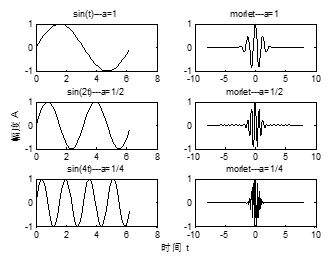
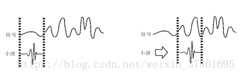
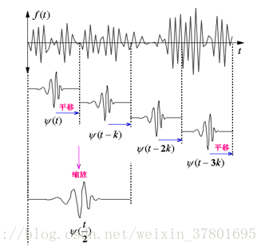
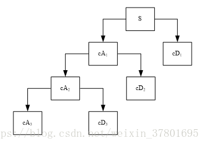
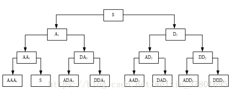

### 【作业二】 图像频域分析

#### 查找并学习小波变换的相关文献资料

##### 一、基本概念

&nbsp;&nbsp;小波变换（wavelet transform，WT）是一种新的变换分析方法，它继承和发展了短时傅立叶变换局部化的思想，同时又克服了窗口大小不随频率变化等缺点，能够提供一个随频率改变的“时间-频率”窗口，是进行信号时频分析和处理的理想工具。它的主要特点是通过变换能够充分突出问题某些方面的特征，能对时间（空间）频率的局部化分析，通过伸缩平移运算对信号（函数)逐步进行多尺度细化，最终达到高频处时间细分，低频处频率细分，能自动适应时频信号分析的要求，从而可聚焦到信号的任意细节，解决了Fourier变换的困难问题，成为继Fourier变换以来在科学方法上的重大突破。
&nbsp;&nbsp;传统的信号理论，是建立在Fourier分析基础上的，而Fourier变换作为一种全局性的变化，其有一定的局限性，如不具备局部化分析能力、不能分析非平稳信号等。在实际应用中人们开始对Fourier变换进行各种改进，以改善这种局限性，如STFT（短时傅立叶变换）。由于STFT采用的的滑动窗函数一经选定就固定不变，故决定了其时频分辨率固定不变，不具备自适应能力，而小波分析很好的解决了这个问题。小波分析是一种新兴的数学分支，它是泛函数、Fourier分析、调和分析、数值分析的最完美的结晶；在应用领域，特别是在信号处理、图像处理、语音处理以及众多非线性科学领域，它被认为是继Fourier分析之后的又一有效的时频分析方法。小波变换与Fourier变换相比，是一个时间和频域的局域变换因而能有效地从信号中提取信息，通过伸缩和平移等运算功能对函数或信号进行多尺度细化分析（Multiscale Analysis），解决了Fourier变换不能解决的许多困难问题。

##### 二、发展历程

&nbsp;&nbsp;小波变换是由法国从事石油信号处理的工程师J.Morlet在1974年首先提出的，通过物理的直观和信号处理的实际需要经验的建立了反演公式，当时未能得到数学家的认可。正如1807年法国的热学工程师J.B.J.Fourier提出任一函数都能展开成三角函数的无穷级数的创新概念未能得到认可一样。幸运的是，早在七十年代，A.Calderon表示定理的发现、Hardy空间的原子分解和无条件基的深入研究为小波变换的诞生做了理论上的准备，而且J.O.Stromberg还构造了历史上非常类似于现在的小波基；1986年著名数学家Y.Meyer偶然构造出一个真正的小波基，并与S.Mallat合作建立了构造小波基的统一方法--多尺度分析之后，小波分析才开始蓬勃发展起来，其中比利时女数学家I.Daubechies撰写的《小波十讲（Ten Lectures on Wavelets）》对小波的普及起了重要的推动作用。与Fourier变换、视窗Fourier变换（Gabor变换）相比，具有良好的时频局部化特性，能有效的从信号中提取资讯，因而小波变化被誉为“数学显微镜”，它是调和分析发展史上里程碑式的进展。

##### 三、算法原理

小波将无限长的三角函数基换成了有限长的会衰减的小波基。这样不仅能够获得频率，还可以定位到时间。
小波公式
$ F(w)=\int^\infty_{-\infty}f(t)*e^{-iwt}dt$
$ WT(a,τ)=\frac{1}{\sqrt{a}}\int^\infty_{-\infty}f(t)*ψ(\frac{t-τ}{a})dt$

从公式可以看出，小波变换有两个变量：尺度a（scale）和平移量 τ（translation）。尺度a控制小波函数的伸缩，平移量 τ控制小波函数的平移。尺度就对应于频率（反比），平移量 τ就对应于时间。
伸缩因子的作用不同的伸缩因子生成不同的频率成分，如下图所示。

平移因子使得小波能够沿信号的时间轴实现遍历分析，如下图所示。

多分辨分析也称为多尺度分析，是建立在函数空间概念上的理论。它构造了一组正交基，使得尺度空间与小波空间相互正交。随着尺度由大到小的变化，可在各尺度上由粗及精地观察目标。这就是多分辨率分析的思想。小波多分辨分析的原理图如下。

小波分解树如下图所示。高频分量称为细节分量，频率分量部分，称为近似分量

小波包分析可以看作是小波分解的一种推广方法，对多分辨分析没有细分的高频分量部分进行进一步的分解，小波包分解树如下图所示。

##### 四、主要应用

&nbsp;&nbsp;小波变换是一种新的变换分析方法，它继承和发展了短时傅立叶变换局部化的思想，同时又克服了窗口大小不随频率变化等缺点，能够提供一个随频率改变的“时间-频率”窗口，是进行信号时频分析和处理的理想工具。它的主要特点是通过变换能够充分突出问题某些方面的特征，因此，小波变换在许多领域都得到了成功的应用，特别是小波变换的离散数字算法已被广泛用于许多问题的变换研究中。从此，小波变换越来越引起人们的重视，其应用领域来越来越广泛。
&nbsp;&nbsp;事实上小波分析的应用领域十分广泛，它包括：数学领域的许多学科；信号分析、图象处理；量子力学、理论物理；军事电子对抗与武器的智能化；计算机分类与识别；音乐与语言的人工合成；医学成像与诊断；地震勘探数据处理；大型机械的故障诊断等方面；例如，在数学方面，它已用于数值分析、构造快速数值方法、曲线曲面构造、微分方程求解、控制论等。在信号分析方面的滤波、去噪声、压缩、传递等。在图象处理方面的图象压缩、分类、识别与诊断，去污等。在医学成像方面的减少B超、CT、核磁共振成像的时间，提高分辨率等。